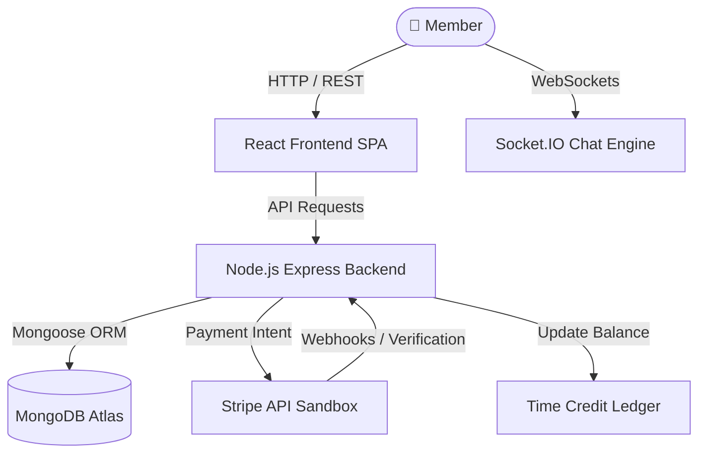

# ⌛ TimeBank — Skill Exchange Economy Powered by Time Credits

<div align="center">


### 🚀 **Peer-to-Peer Skill Exchange Platform Powered by Time Credits & AI Smart Matching**

[Key Features](#-key-features) • [Tech Stack](#%EF%B8%8F-technology-stack) • [Quick Start](#-getting-started) • [Architecture](#-system-architecture) • [Stripe Testing](#-stripe-payment-testing-guide)

---

</div>

<br/>

## 🌟 Executive Summary

**TimeBank** is a modern, AI-powered peer-to-peer skill-exchange platform. Unlike traditional freelance marketplaces that rely on direct monetary payments, TimeBank operates on a **time-credit ledger economy**:

> 💡 **Core Principle**: *1 Hour of Teaching = 1 Time Credit Earned*. Spend your earned credits to learn any skill from mentors worldwide!

```
[ Teach Skill ] ──> +1 Time Credit ──> [ TimeBank Ledger ] ──> -1 Time Credit ──> [ Learn New Skill ]
```

---

## 🔥 Key Features

### 1. 🤝 Peer-to-Peer Skill Exchange
- **Dual Skill Modes**: Post skills to **Teach** or **Learn**.
- **Flexible Scheduling**: Set availability by days, time slots, and experience levels.

### 2. 🧠 Smart Matching
- **Natural Language Search**: Describe requirements like *"I need React mentoring this weekend in English"* to discover top matches.
- **Match Scoring**: Multi-factor ranking based on skill level, language, availability, and rating.

### 3. 💳 Double-Entry Time Credit Ledger
- **Guaranteed Balance Security**: Transactions are recorded via an immutable ledger (`EARN`, `SPEND`, `TRANSFER`, `BONUS`).
- **Welcome Bonus**: 5 free Time Credits automatically gifted to new registered members.

### 4. ⚡ Seamless Stripe Payment & Monetization
- **Stripe Checkout Sandbox Integration**: Buy Extra Time Credit Packs (`+5`, `+15`, `+30`) or upgrade to **Premium Membership** (`Monthly` / `Yearly`).
- **Instant Entitlements**: Automatic credit top-ups and VIP Verified status on payment confirmation.

### 5. 💬 Real-Time Chat & Exchange Lifecycle
- **Socket.IO Real-Time Messaging**: Built-in direct chat linked to active skill exchanges.
- **Exchange Lifecycle**: `REQUESTED` ➔ `ACCEPTED` ➔ `SCHEDULED` ➔ `COMPLETED` with mutual confirmation rules.

---

## 🛠️ Technology Stack

| Layer | Technologies & Tools |
| :--- | :--- |
| **Frontend UI** | React 18, TypeScript, TailwindCSS, Lucide Icons, Vite |
| **Backend API** | Node.js, Express.js, TypeScript, ts-node-dev |
| **Database & ORM** | MongoDB Atlas, Mongoose ODM |
| **Real-time Engine** | Socket.IO (WebSockets) |
| **Payment Gateway** | Stripe API Sandbox (Checkout & Webhooks) |
| **Security & Auth** | JWT Authentication, Bcrypt Password Hashing, CORS |

---

## 🏗️ System Architecture



---

## 🚀 Getting Started

Follow these steps to run the complete TimeBank project locally on your machine.

### 📋 Prerequisites
- **Node.js** (v18.x or higher)
- **npm** (v9.x or higher)
- **MongoDB** Atlas database URI or local MongoDB instance

---

### 1. 📁 Repository Setup

```bash
# Clone the repository
git clone https://github.com/your-username/TimeBank.git

# Navigate into project folder
cd TimeBank
```

---

### 2. ⚙️ Backend Setup & Configuration

```bash
# Move to backend directory
cd backend

# Install backend dependencies
npm install

# Create environment configuration (.env)
```

Create a `.env` file inside `backend/` with the following variables:

```env
PORT=5000
MONGODB_URI=mongodb+srv://<username>:<password>@cluster.mongodb.net/timebank
JWT_SECRET=timebank_super_secret_jwt_key_2026_safe
JWT_EXPIRES_IN=7d
CLIENT_URL=http://localhost:5173

# Stripe Sandbox Keys
STRIPE_PUBLISHABLE_KEY=pk_test_your_stripe_publishable_key
STRIPE_SECRET_KEY=sk_test_your_stripe_secret_key
```

Start the backend dev server:

```bash
npm run dev
```
> Server running at: `http://localhost:5000/api`

---

### 3. 💻 Frontend Setup

Open a new terminal window:

```bash
# Move to frontend directory
cd frontend

# Install frontend dependencies
npm install

# Start Vite development server
npm run dev
```
> Application running at: `http://localhost:5173`

---

## 💳 Stripe Payment Testing Guide

To test payments using the integrated **Stripe Sandbox Gateway**:

1. Navigate to the **Payment & Membership** page in the app.
2. Select any **Premium Plan** (`₹299/mo` or `₹2,499/yr`) or **Time Credit Pack** (`+5`, `+15`, `+30`).
3. Use official **Stripe Test Cards**:
   - **Card Number**: `4242 4242 4242 4242`
   - **Expiry Date**: Any future date (e.g., `12/34`)
   - **CVC**: `123`
4. Click **Pay with Stripe** to instantly complete transaction and verify credit wallet top-up!

---

## 📂 Project Structure

```
TimeBank/
├── backend/
│   ├── src/
│   │   ├── config/          # Database & Server Config
│   │   ├── middleware/      # JWT Authentication & Verification
│   │   ├── modules/
│   │   │   ├── auth/        # Login / Register / Profile API
│   │   │   ├── payments/    # Stripe Payments & Entitlements
│   │   │   ├── users/       # User Schemas & Model
│   │   │   ├── wallet/      # Time Credit Double-Entry Ledger
│   │   │   └── exchanges/   # Session Lifecycle Management
│   │   ├── sockets/         # Real-time Socket.IO Chat
│   │   └── server.ts        # Express App Entry Point
│   └── package.json
│
├── frontend/
│   ├── src/
│   │   ├── components/      # UI Cards, Badges, Modals
│   │   ├── context/         # AuthContext & User State
│   │   ├── pages/           # Dashboard, Discover, Exchanges, PaymentPage
│   │   ├── services/        # Axios API Client Setup
│   │   └── types/           # TypeScript Data Models
│   └── package.json
│
└── README.md                # Project Webpage Documentation
```

---

<div align="center">

### 🌐 Built with ❤️ for the Global Skill Sharing Community

*TimeBank — Where your time creates real value.*

</div>
